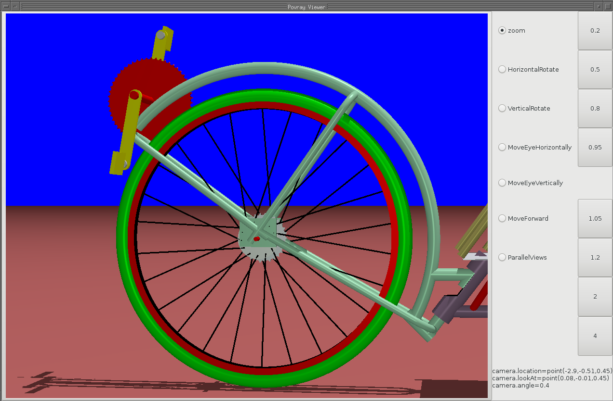
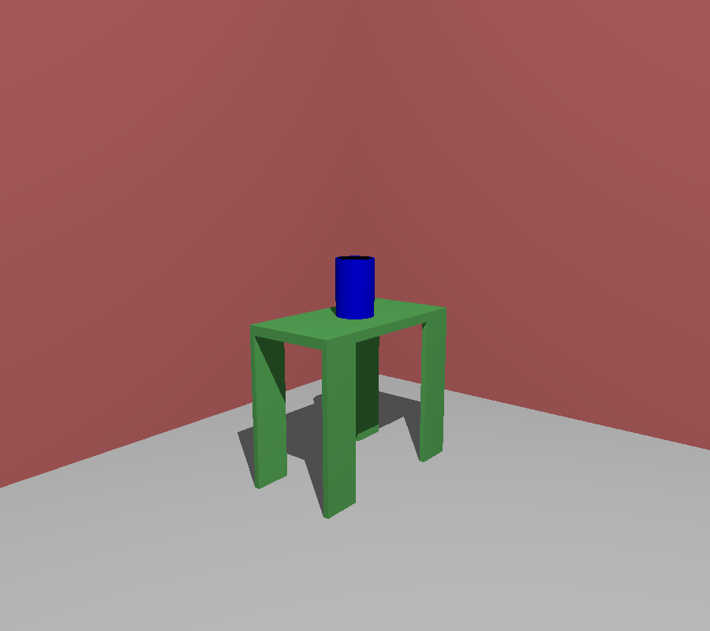

****************************************************
Discover Pycao
****************************************************
.. image:: ./docPictures/maisonLau.png
    :height: 400px
    :align: left

.. image:: ./docPictures/bike.png
    :height: 400px
    :align: right
	    
.. image:: ./docPictures/drawer.png	    
    :height: 400px
    :align: right
	    
What is Pycao  in a few words ?
=========================================

Pycao is a 3D-modeller for Python. In other words, Pycao is a language
based on Python usable to describe a 3D-scene. In practice, you describe your
3D-picture writing python/pycao code, you run python on your code, and that's
it, you get your image. Pycao is usable both
for photo realistic 3D (as the room of the first image) or as a CAD
software with precise measurements (as the bike prototype in the
second image). 

Pycao does not compete with professional tools carrying thousands of
options. The focus of Pycao is towards  simplification rather than
versatility. To be honest, 3D-drawing is difficult, whatever the
approach. But Pycao tries to make 3D-design as simple as it can be,
and hopefully makes 3D modelisation of real projects possible for the
hobbyist or the scientist. 
It may be suitable for people with a project of medium size,
like building a wood furniture, a bike or drawing  a scientific illustration,
discouraged by the complexity and/or inapropriate documentation of
some 3D software.

The choices in the design of Pycao are the following.
It relies on Python because Python is
an object-oriented language with a rich vocabulary and a
simple syntax. This helps to minimize the time necessary to code our models. 
A good documentation is required to work in good conditions, and
one of the objectives is to furnish a good complete documentation.
Finally, Pycao is free from 
any graphical interface, for simplicity and power. We use
our prefered editor with  no supplementary environment to learn.
This approach  makes it possible
to bridge the 3D software with data from external program. 

Is Pycao a Povray modeller ?
===============================================

Yes. In the background, Pycao relies heavily on the Povray software, but you don't need
to know povray to use Pycao. You just write your Python code to
describe your scene. Then Pycao takes the Python objects you have
constructed and generates Povray code corresponding to your objects.
Then povray is used to produce the images.

Originally, the goal was to produce a Blender modeller, rather than a
Povray modeller. However, the documentation in Povray is more precise and I decided to switch to
povray, as I could not carry out the project with Blender.

It would be nice to get stl files from pycao, but unfortunatly, this
is not done. Only povray code is produced. 

Where is the graphical interface ?
-------------------------------------------------------------------------

In the first versions of Pycao, there was no graphical interface.
A simple image appeared after the compilation of the python code. 

However, choosing the location of the camera, zooming, ... to get
exactly the expected image was time consuming. Now, 
once you have modelled an object or a scene, the scene will be
displayed after compilation in a window where you can move the camera, the zoom...
in an interactive way with buttons. It is also possible to
visualize standard povray files modelled out of povray with the
viewer. The viewer and the buttons look like this

However, Pycao is not a graphical modeller, and there is no
graphical tool beyond the post compilation interface. 
My experience is that describing a 3D object
with a mouse on a 2D screen is very very
challenging.
Pycao is designed towards people who think that it is easier to 
describe a 3d object with a good language than with a graphical
interface, or for people who want to easily draw a 3D picture using
output from an other software. 

How is designed the pycao code ?  What are the objectives.
=================================================================

Shortening the necessary code for the description of an object is the main
objective of Pycao.  Simplifying  paradigms towards this objective
have been introduced :carrying objects in boxes, genealogy system
with parents and children, CSG geometry, hooks which are
markers similar to the pen marks in a workshop, measurements 
possible from the left and from the right using various units, easy to
build libraries ... 

To get an idea of the complexity, 
the above bike requires around 250 lines of code. The simple scene with a table or a wheel as below require in the library
around 20 lines of code for the geometrical description, plus a few lines of code for
the colors. 

.. image:: ./docPictures/wheel.png

The second main objective of Pycao is to make the code coordinate
free. Maybe you have experienced the problem : you have 200 lines of
codes, you change the coordinate of an oject line 56 and then you have to read and
adapt the following lines after this change. For this reason, the
geometric code saying "put this object above this one" is more stable
than the code based on coordinates saying "put this object at
coordinate (x,y,z)". For maintanability, 
the code in pycao aims to be as close as possible to the natural
coordinate free language a carpenter would use in the workshop. 
It avoids math computations in
coordinates as much as possible. However, mathematical computations are
sometimes unavoidable, and the mathematical language of affine geometry ( barycenters,
points and vectors, affine transformations ...) is nativly understood
by Pycao when needed. 

I am new to 3D. What are the alternatives to pycao ?
==============================================================================

In the free software world, we find freecad, blender, povray, salome,
openscad. Although all are great tools, their philosophies
are different. Here are a few words to help you choose the project
suitable to you. 

The povray language is a language with a very complete and 
clear documentation. This makes it easy to master this language.
On the other hand, povray language is a very "low level" language, where 
the description of an object is quite involved: you need to compute
plenty of coordinates, no genealogy, 
no classes or inheritance, many curly braces around. 
Povray is a fantastic piece of code, very precise, but 
the code required to describe a 3D-object is long,difficult to write,
to read and to maintain. 
This is logical and povray is not to blame: povray is a rayTracer, not a modeler, The
language is built to feed the rayTracer, not to simplify the work of 
the developper. 

Blender, Freecad, Salome include both graphical modeler and scripting
possibilities. I will comment only on the scripting possibilities. 

Blender comes with a python api. If you work mostly with the graphical
interface, with rare use of the api, it may be a good choice.
If you use intensivly the api, you should avoid blender. 
The api is very complex because of its 
integration with the graphical tool: be ready to spend countless hours to understand the "context errors" 
in your code, be ready to see some variables updated by the api
without your asking for. Since there is a very active community in
Blender, you will find help for these problems and for the debugging work.

Freecad and Salome api seem powerful. I have not used them very much because
they appeared to be too complex for my needs. The philosophy is very different from
pycao, they are API whereas Pycao is a modeller.
Both try to give the user power and versatility rather than a
simplified syntax to describe the model. The code is marked by the
integrated environnement whereas pycao aims ease of
use for small/medium projects, and freeness from any environnment. 

Openscad exports to stl (pycao does not). Thus Openscad may be usable for 3D-printing
machines. It uses a simple low level language with few
paradigms simplifying the 3d-description and you have to perform
math computations of coordinates by yourself to draw the object. For simple parts of a
machine, this simplicity is an advantage. However, 
I hardly imagine a complete modelisation of a bike and a dummy as
above with this language.  Photo realistic
drawing is not possible with openscad. 

I am an expert. A few words about the architecture ? 
-------------------------------------------------------
Pycao is a Python module which 
constructs some python objects using your code. Then an instruction camera.shoot
at the end of your python code calls a module povrayshoot.py. Povrayshoot 
takes  the objects you built 
as input and produces  povray code as output.
An other instruction camera.show in your code calls povray
to create the image file  nameOfYourImage.png from the povray code
and shows the image in the viewer. 

In other words, in the dialog chain from the developper to the
raytracer, pycao talks with the developper, the povray language talks with the
raytracer, and povrayshoot  makes the translation between pycao and
povray. The architecture is then:

.. centered::
   developper <---> pycao <---> povrayshoot <---> povray language <--->
   raytracer kernel

In principle, it would be possible to export to stl or blender
replacing only the povrayshoot module of pycao. 

 
What are the defaults of pycao ?
--------------------------------------------------------------------

This is a young software. There are bugs, hopefully not too
much however. I am a Linux user, so I don't make test with Windows. 

The vocabulary of the language may still evolve 
in the future, if we can express things in a more natural way. 
So do not use this software for a long term project now. 
Use it for small projects by now. 

Finally, there is no community around this project. Some autonomy 
to use it is required. 

Is it free software ?
==============================

Yes. The license is GPL v3.0. 

Acknowledgments
=================================

The pycao project stemmed from my experiments with Blender and
Povray. I warmly thank the developpers of Blender and Povray
because I have learned so much from their software.  

